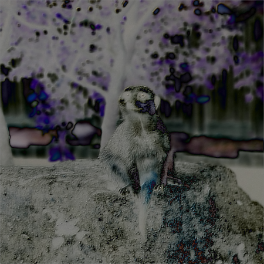
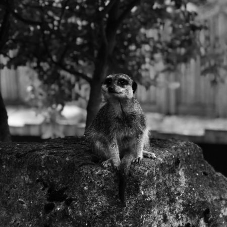
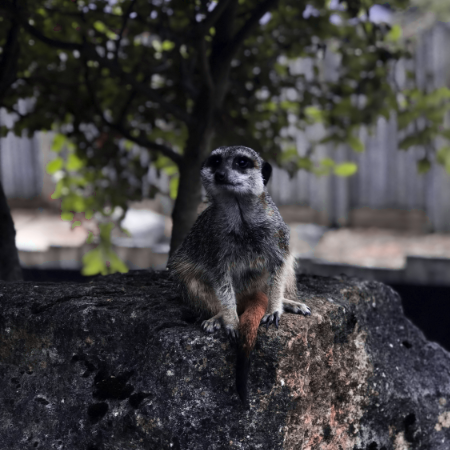
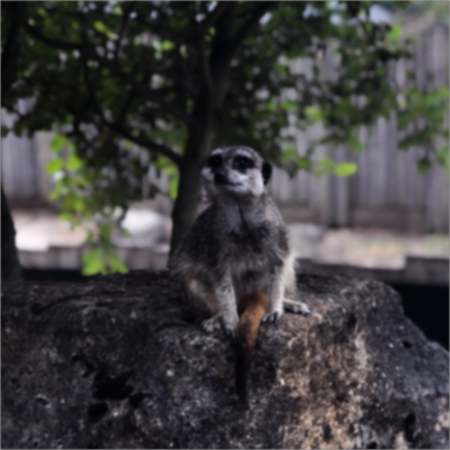
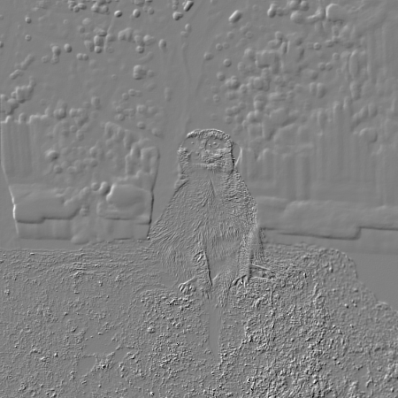

## Usage
```
usage: image_modifier_no_parallism <grey|emboss|blur|hsv> <input file> <output file>

convert image colors
        grey    converts the colors to greyscale
        hsv     converts the rgba to the hsv colorspace

apply filter to image
        emboss  applies the emboss filter
        blur    blurs the image via a gaussian blur filter
```
All implementations are using the same CLI concepts.
First the operation is specifed, second the input file needs to be provied. The last arguments specifies the path of the output file.
There are two groups of operations: converters and filters.
A converter will take the colorspace of the input file and transform it by the given operation.
On the other hand a filter will manipulate the image by a given filter matrix or algorithm. The resulting image will have different shapes than the orginal. 

## Building
To build the default implementations with OpenCV just use
the `make all` command.
If you want to specifiy the libraries use one of the recipes which are listed below.
All except the C# implemention binaries will be written to the `bin/` folder.

### C++ Project
To build the non parallism version use one of the `no_parallism` recipes.
The simplest build is triggered by calling `make no_parallism` but note that there are more recipes for building the non parallism version.
The default recipe `no_parallism` uses OpenCV as image library.
The second recipe `no_parallism_cimg` builds the implementation with the CImg library instead.
The last recipe `no_parallism_lodepng` uses the lodepng library.

### CUDA Project
There are three different recipes for building the CUDA version available.
The default one can be called by `make cuda` and uses the OpenCV library as stated above.
The second recipe `cuda_cimg` uses the CImg library.
The third recipe `cuda_lodepng` uses the lodepng library instead.

### .Net Project
The .NET implementation uses the latest .Net Core 3 framework version with the ImageSharp library for loading and manipulating the images.
The project can be build and run with `dotnet run`.

## Testing
Testing the C++ implementions can be done by utilising the `run_...sh` script in the root folder.
For each implemention exists one script which builds and runs the all operations of all versions on one image.

Different test results show that as long as the CUDA overhead is bigger than the operation and the image the non parallism version will be more performant.
But with complex operations (like gaussian blur) and large images the CUDA version supersedes the non parallism one by far.
Also as long as the graphics card is not fully working to capacity the operation time for the CUDA version remains almost the same.

### CUDA
The CUDA implemention with OpenCV can be run with `bash run_cuda.sh`.
The script `bash run_cuda_lodepng.sh` runs the implementation with the lodepng library.
Note that the lodepng library has no further dependencies but requires all images to be in the PNG format.

### C++ Non Parallism
There are three different implementions with three different libraries for loading images.
The default implementation with OpenCV can be run with `bash run_no_parallism.sh`.
The second implementation uses the library CImg and can be run with `bash run_no_parallism_cimg.sh`. The last implementation uses lodepng and can be run with `bash run_no_parallism_lodepng.sh`.

## Tools

### Performance Test
To run a performance test with all example images in the `examples/` folder use
the script `perftest_lodepng.py`. To run it use the python interpreter with `python perftest_lodepng.py`.
It uses the lodepng implementation which requires the example images to be in the PNG format.
The script starts with a build of the non parallism and CUDA version.
After that the script runs the operations greyscale, hsv and gaussian blur on every example image provided.

### Compare Images
To compare the results of the different implementations and frameworks
the script `compare_images.py` can be used.
It generates a output image that contains the pixel color difference of two images.
Note that the alpha channel is ignored.

An example output for the operation `compare_images.py export/example_image1_small_blur.png export/example_image1_small_emboss.png export/difference_example_image1.png` can be seen here:


## Operations
Note that if not explicitly stated all operations are crosscompatible between the non parallism and CUDA version.
The operations can be called by including the `ìmg_operations.hpp` header file .

### Greyscale
```
int op_grey(uint32_t width, uint32_t height, uint32_t *data)
```
The operation greyscales the image colors. The alpha channel stays untouched.

Returns `EXIT_SUCCESS` if the operation was successful otherwise `EXIT_FAILURE`. 

Example output:


### HSV
```
int op_hsv(uint32_t width, uint32_t height, uint32_t *data)
```
The operation converts the image from RGBA color space to HSV. The alpha channel
is lost. This operation works best with the OpenCV implementation.
Due to inconsistend implementations of the HSV color spectrum this operation tries
to be compatible with OpenCV and uses a optimized calculation (see below).
```
if(cmax == red)
	hue = 43 * ((green - blue) / diff);
else if(cmax == green)
	hue = 85 + 43 * ((blue - red) / diff);
else
	hue = 200 + 171 + 43 * ((red - green) / diff); /* 200 is temporary. It works for some reason. */
			
```

Returns `EXIT_SUCCESS` if the operation was successful otherwise `EXIT_FAILURE`. 

Example output:


### Gaussian Blur
```
int op_blur(uint32_t width, uint32_t height, uint32_t *data)
```
The operation applies a gaussian filter to the image. Note that the filter values are predefined
and not calculated at runtime. Because of this the filter is fixed in size (see below).
```
float filter[filter_size][filter_size] =
{
	{1.0f,  4.0f,  6.0f,  4.0f,  1.0f},
	{4.0f, 16.0f, 24.0f, 16.0f,  4.0f},
	{6.0f, 24.0f, 36.0f, 24.0f,  6.0f},
	{4.0f, 16.0f, 24.0f, 16.0f,  4.0f},
	{1.0f,  4.0f,  6.0f,  4.0f,  1.0f}
};
```
Also this filter is only an approximation of the resulting gaussian distribution.
It is possible to replace the filter but the filter size needs to be adjusted accordingly.
A smaller filter could look like this:
```
double filter[filter_size][filter_size] =
{
	{0.077847, 0.123317, 0.077847},
	{0.123317, 0.195346, 0.123317},
	{0.077847, 0.123317, 0.077847}
};
```
Again, this is filter is only an approximation.

Returns `EXIT_SUCCESS` if the operation was successful otherwise `EXIT_FAILURE`. 

Example output:


### Emboss
```
int op_emboss(uint32_t width, uint32_t height, uint32_t *data)
```
The operation applies a basic edge detection filter to the image. Important to note is the fact that this operation is not implemented for the CUDA version.
The filter calculates the differences between two pixel color values and looks for the current maximum difference. The output looks mostly grey with the edges pushed in or out.

Returns `EXIT_SUCCESS` if the operation was successful otherwise `EXIT_FAILURE`. 

Example output:
